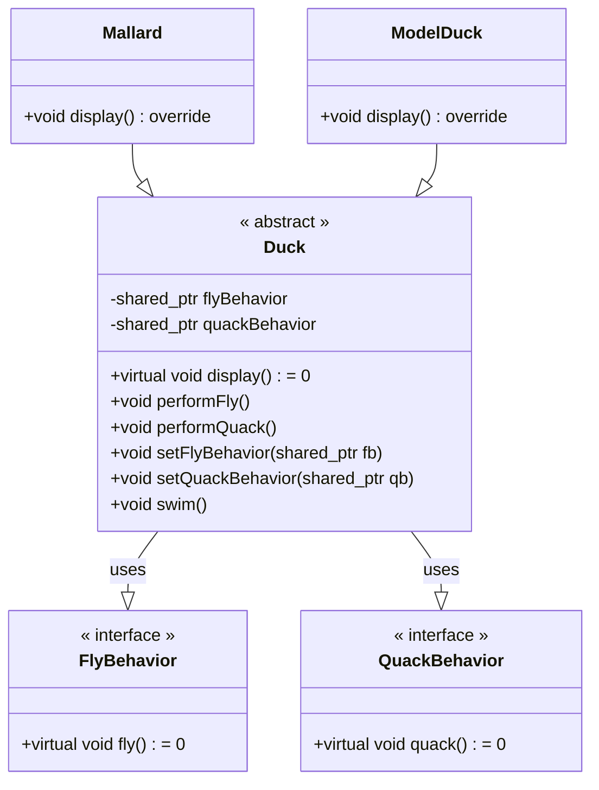
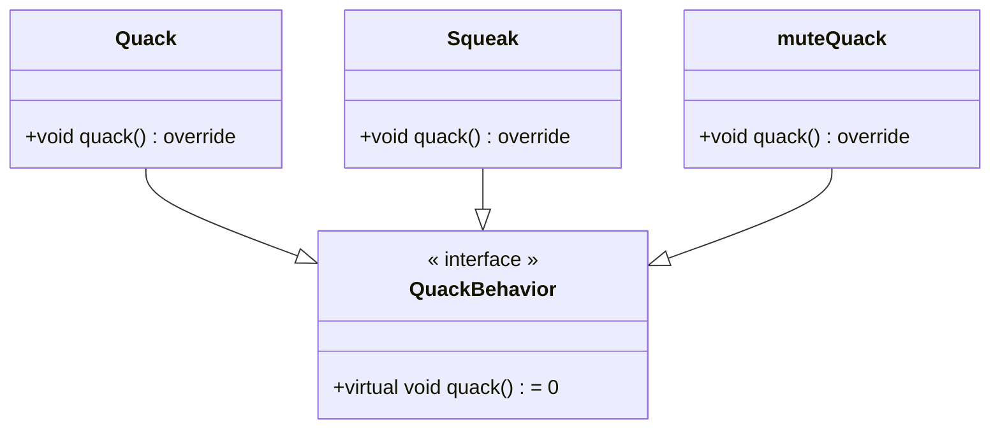
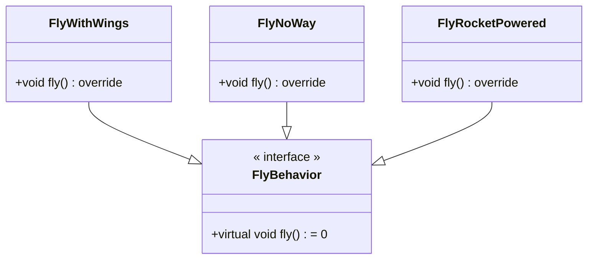

# C++ 实现 Headfirst 设计模式

## 策略模式

!!! abstract "策略模式"
	定义算法族，分别封闭起来，让它们之间可以互相替换，此模式让算法的变化独立于使用算法的客户

本章要实现一个 `Duck` 类，鸭子可以飞可以叫。但问题是：

- 我们可能有不会飞的鸭子，甚至不会叫的鸭子
	
	- 可以通过继承将基类的鸭子飞行和叫的方法覆盖掉，但是类很多的时候，挨个覆盖并不优雅
	- 同样的，如果通过有选择地实现 `fly` 接口，会产生代码无法复用的问题

我们应该利用继承与接口实现 `Duck` 类的问题。将变化的行为封闭为类，`Duck` 类将动作“委托”给其他类处理，而不是定义在 `Duck` 类中
利用 `setter` 方法动态设定行为。

在这里，我们将 `Duck` 类中的 `flyBehavior` 和 `quackBehavior` 都封装为了一个类，其行为由相应的类负责。这样鸭子的行为就和鸭子类无关了。

注意，我们的 `Duck` 类是一个抽象类，它必须实例化之后才可以使用。为了实现从父类调用子类方法，我们需要使用指针（在这里使用了智能指针），并使用 `virtual` 关键字。

在子类中重写父亲方法，使用 `override` 关键字可以让编辑器辅助检查是否重写了虚函数，避免因函数参数不同等问题，造成重写失败。

那么这样就实现了鸭子类的功能。我们封装了变化。使用组合而不是继承，增加了代码的复用性，同时便于拓展

## 观察者模式

## 装饰者模式

## 工厂模式

## 单例模式