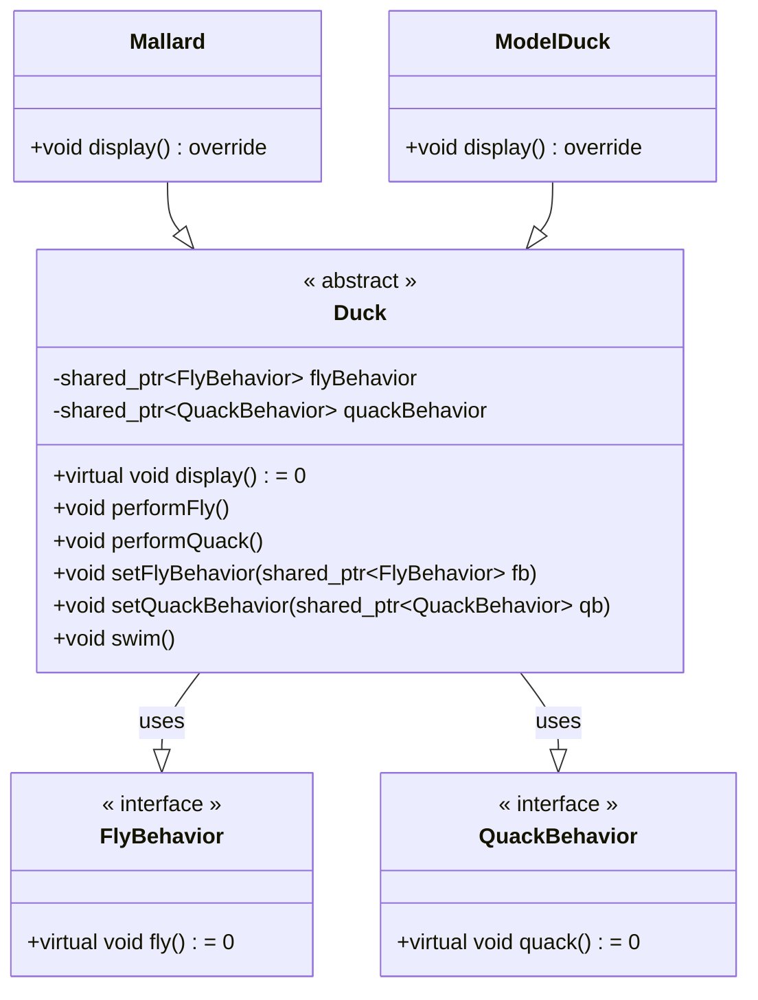
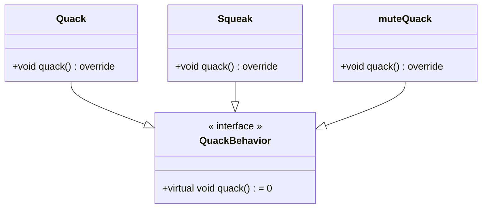
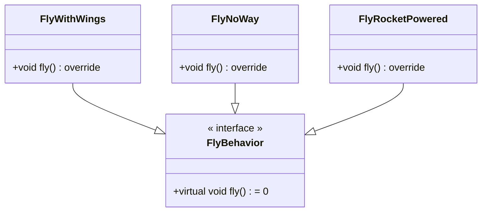
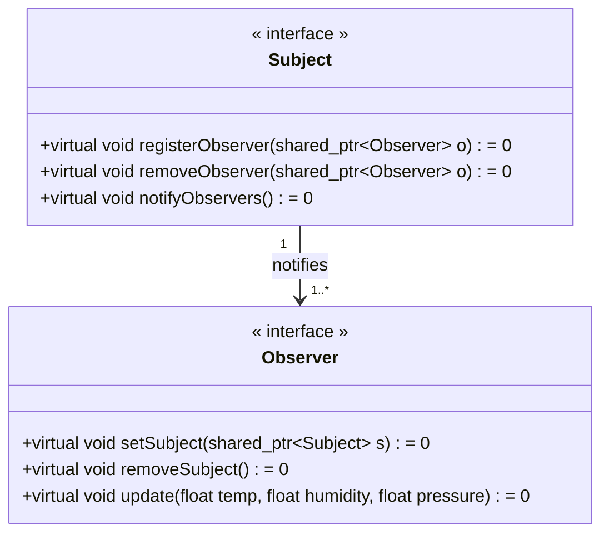
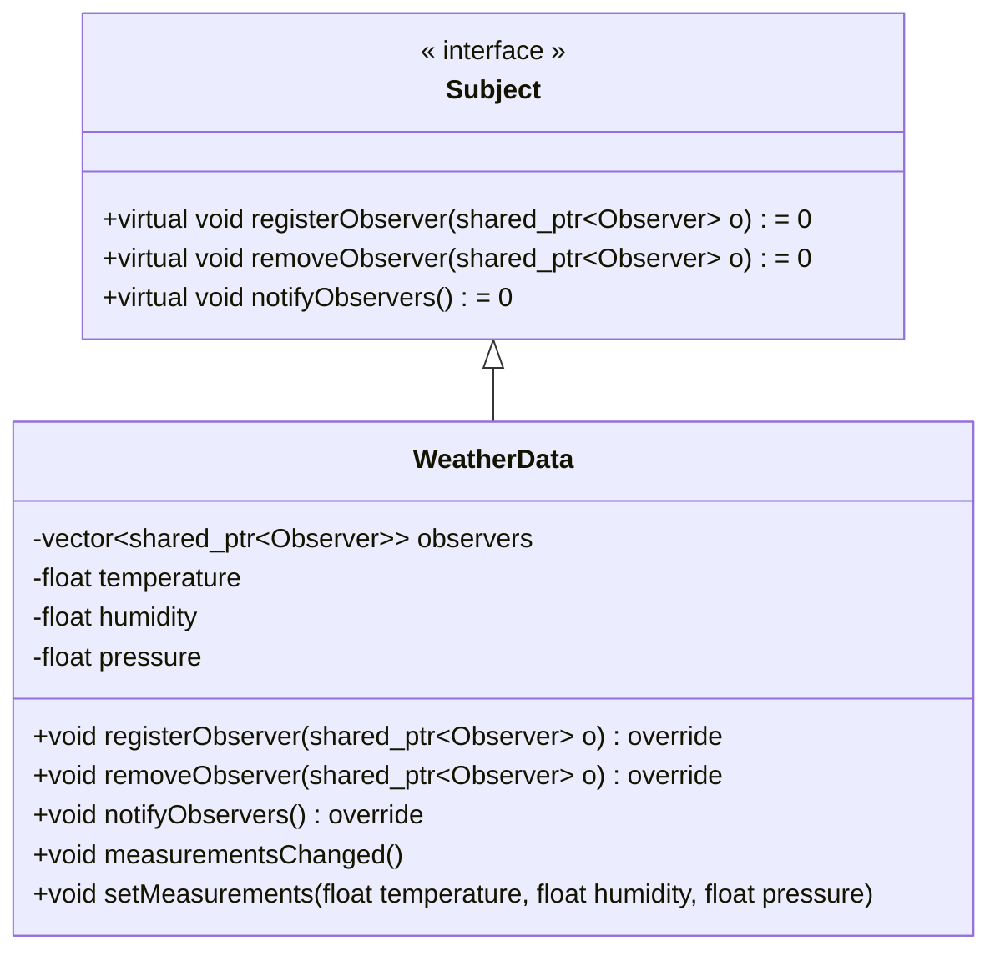
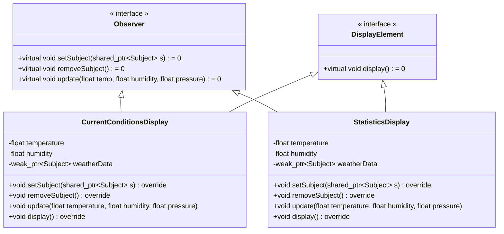

# C++ 实现 Headfirst 设计模式

## 策略模式

!!! abstract "策略模式"
	定义算法族，分别封闭起来，让它们之间可以互相替换，此模式让算法的变化独立于使用算法的客户

### 会叫会飞的鸭子

本节要实现一个 `Duck` 类，鸭子可以飞可以叫。但问题是：

- 我们可能有不会飞的鸭子，甚至不会叫的鸭子
	
	- 可以通过继承将基类的鸭子飞行和叫的方法覆盖掉，但是类很多的时候，挨个覆盖并不优雅
	- 同样的，如果通过有选择地实现 `fly` 接口，会产生代码无法复用的问题


我们应该利用继承与接口实现 `Duck` 类的问题。将变化的行为封闭为类，`Duck` 类将动作“委托”给其他类处理，而不是定义在 `Duck` 类中。
我们还可以利用 `setter` 方法动态设定行为。




在这里，我们将 `Duck` 类中的 `flyBehavior` 和 `quackBehavior` 都封装为了一个类，其行为由相应的类负责。这样鸭子的行为就和鸭子类无关了。

注意，我们的 `Duck` 类是一个抽象类，它必须实例化之后才可以使用。使用 C++ 时，为了实现从父类调用子类方法，我们需要使用指针（在这里使用了智能指针），并使用 `virtual` 关键字。

此外，由于 C++ 中没有 `interface` 关键字，我们实际还是使用抽象类来实现“接口”，后续的章节也是一样的操作。




在子类中重写父亲方法，使用 `override` 关键字可以让编辑器辅助检查是否重写了虚函数，避免因函数参数不同等问题，造成重写失败。




那么这样就实现了鸭子类的功能。我们封装了变化。使用组合而不是继承，增加了代码的复用性，同时便于拓展。

??? caution "代码拿来"

	```cpp
	// Strategy Pattern

	#include <iostream>
	#include <memory>
	using namespace std;

	class FlyBehavior {
	public:
	virtual void fly() = 0;
	};

	class QuackBehavior {
	public:
	virtual void quack() = 0;
	};

	// abstract class
	class Duck {
	protected:
	shared_ptr<FlyBehavior> flyBehavior;
	shared_ptr<QuackBehavior> quackBehavior;

	public:
	Duck() {}
	virtual void display() = 0;
	void performFly() { flyBehavior->fly(); }
	void performQuack() { quackBehavior->quack(); }
	void setFlyBehavior(shared_ptr<FlyBehavior> fb) { flyBehavior = fb; }
	void setQuackBehavior(shared_ptr<QuackBehavior> qb) { quackBehavior = qb; }
	void swim() { cout << "All ducks float, even decoys!" << endl; }
	};

	class FlyWithWings : public FlyBehavior {
	public:
	void fly() override { cout << "I'm flying!!" << endl; }
	};
	class FlyNoWay : public FlyBehavior {
	public:
	void fly() override { cout << "I can't fly" << endl; }
	};
	class FlyRocketPowered : public FlyBehavior {
	public:
	void fly() override { cout << "I'm flying with a rocket" << endl; }
	};

	class Quack : public QuackBehavior {
	public:
	void quack() override { cout << "Quack" << endl; }
	};
	class Squeak : public QuackBehavior {
	public:
	void quack() override { cout << "Squeak" << endl; }
	};
	class muteQuack : public QuackBehavior {
	public:
	void quack() override { cout << "<< Silence >>" << endl; }
	};

	class Mallard : public Duck {
	public:
	Mallard() {
		quackBehavior = make_shared<Quack>();
		flyBehavior = make_shared<FlyWithWings>();
	}
	void display() override { cout << "I'm a real Mallard duck" << endl; }
	};

	class ModelDuck : public Duck {
	public:
	ModelDuck() {
		flyBehavior = make_shared<FlyNoWay>();
		quackBehavior = make_shared<Quack>();
	}
	void display() override { cout << "I'm a model duck" << endl; }
	};

	int main() {
	unique_ptr<Duck> mallard(make_unique<Mallard>());
	mallard->performQuack();
	mallard->performFly();
	unique_ptr<Duck> model(make_unique<ModelDuck>());
	model->performFly();
	model->setFlyBehavior(make_shared<FlyRocketPowered>());
	model->performFly();
	}

	```

### 总结

设计原则

- 封装变化
- 多用组合，少用继承
- 针对接口编程，不针对实现编程

## 观察者模式

!!! abstract "观察者模式"
	定义了对象之间的一对多依赖，这样一来，当一个对象改变状态时，它的所有依赖者都会收到通知并自动更新

### 气象站与气象展示板

本节需要实现气象站与气象展示板的关系。气象站会定时更新气象数据，而气象展示板会显示最新的气象数据。

一种不合适的做法是在气象站类中直接调用气象展示板的方法，这样会导致气象站和气象展示板之间的耦合度过高。一旦气象展示板需要增加或减少，气象站类也需要修改。（不应当针对具体实现编程）

我们可以使用观察者模式来解决这个问题。观察者模式定义了对象之间的一对多依赖，这样一来，当一个对象改变状态时，它的所有依赖者都会收到通知并自动更新。
并且，观察者可以自由地订阅或取消订阅。

首先是 `Subject` 和 `Observer` 的接口。这里我们采用的是主题“推”数据的方式，即主题将数据推送给观察者。
关于“推”和“拉”的区别在于，如果使用“拉”数据的方式，观察者需要主动去获取数据，可以有选择地使用 `getter` 方法获取数据；而使用“推”数据的方式，主题会主动将数据推送给观察者，推送的数据是主题的全部数据，而不是观察者需要的特定部分数据。一般来说，“推”的方式更为“正确”

需要注意的是，由于观察者定义需要有主题的定义，主题定义也需要观察者的定义，在定义两个类时，需要使用前向声明，否则会出现编译错误。



`WeatherData` 类实现了主题类，它维护了一个观察者列表，并且实现了注册、删除和通知观察者的方法。同时，`WeatherData` 类还维护了气象数据的状态，并且在数据发生变化时通知观察者。



`DisplayElement` 抽象类和各个展示板的实现类。在观察者模式中，由于主题和观察者相互持有对方的引用，因此需要使用 `weak_ptr` 来避免循环引用。

同时，因为观察者类在设置主题时，需要调用主题的注册方法，这也就意味需要把一个 `this` 指针创建为 `shared_ptr` 传递给主题。
如果有多个主题，使用 `this` 裸指针会导致多次创建 `shared_ptr`。
从裸指针创建 `shared_ptr` 只可创建一次，否则多次创建 `shared_ptr`，会导致多次创建控制块，引发错误。

因此我们需要继承 `enable_shared_from_this<T>` 来保证 `this` 指针只创建一次控制块。
关于这个 `enable_shared_from_this<T>` 的用法，有一个专门的名字叫奇异递归模板模式，可以自行搜索。需要注意的是，调用 `shared_from_this()` 时，必须保证 已经调用过 `shared_ptr<T>` 的构造函数，否则会报错（即，类实例是一个由 `shared_ptr` 管理的对象）。



??? caution "代码拿来"

	```cpp
	// observer pattern

	#include <algorithm>
	#include <iostream>
	#include <memory>
	#include <vector>

	using namespace std;

	class Subject;
	class Observer {
	public:
	virtual void setSubject(shared_ptr<Subject> s) = 0;
	virtual void removeSubject() = 0;
	virtual void update(float temp, float humidity, float pressure) = 0;
	};

	class Subject {
	public:
	virtual void registerObserver(shared_ptr<Observer> o) = 0;
	virtual void removeObserver(shared_ptr<Observer> o) = 0;
	virtual void notifyObservers() = 0;
	};

	class DisplayElement {
	public:
	virtual void display() = 0;
	};

	class WeatherData : public Subject {
	private:
	vector<shared_ptr<Observer>> observers;
	float temperature;
	float humidity;
	float pressure;

	public:
	void registerObserver(shared_ptr<Observer> o) override {
		observers.push_back(o);
	}
	void removeObserver(shared_ptr<Observer> o) override {
		auto it = find(observers.begin(), observers.end(), o);
		if (it != observers.end()) {
		observers.erase(it);
		}
	}
	void notifyObservers() override {
		for (auto o : observers) {
		o->update(temperature, humidity, pressure);
		}
	}
	void measurementsChanged() { notifyObservers(); }
	void setMeasurements(float temperature, float humidity, float pressure) {
		this->temperature = temperature;
		this->humidity = humidity;
		this->pressure = pressure;
		measurementsChanged();
	}
	};

	class CurrentConditionsDisplay
		: public Observer,
		DisplayElement,
		public enable_shared_from_this<CurrentConditionsDisplay> {
	private:
	float temperature;
	float humidity;
	weak_ptr<Subject> weatherData; // actually, one observer can observe many
									// subjects, but we don't implement it here

	public:
	CurrentConditionsDisplay() = default;
	~CurrentConditionsDisplay() { removeSubject(); }

	void setSubject(shared_ptr<Subject> s) override {
		if (weatherData.lock() != nullptr) {
		return;
		}
		weatherData = s;
		s->registerObserver(shared_from_this());
	}

	void removeSubject() override {
		auto sptrWeatherData = weatherData.lock();
		if (sptrWeatherData == nullptr) {
		return;
		}
		sptrWeatherData->removeObserver(shared_from_this());
		weatherData.reset();
	}

	void update(float temperature, float humidity, float pressure) {
		this->temperature = temperature;
		this->humidity = humidity;
		display();
	}
	void display() override {
		std::cout << "Current conditions: " << temperature << "F degrees and "
				<< humidity << "% humidity" << std::endl;
	}
	};

	class StatisticsDisplay : public Observer,
							DisplayElement,
							public enable_shared_from_this<StatisticsDisplay> {
	private:
	float temperature;
	float humidity;
	weak_ptr<Subject> weatherData;

	public:
	void setSubject(shared_ptr<Subject> s) override {
		if (weatherData.lock() != nullptr) {
		return;
		}
		weatherData = s;
		s->registerObserver(shared_from_this());
	}

	void removeSubject() override {
		auto sptrWeatherData = weatherData.lock();
		if (sptrWeatherData == nullptr) {
		return;
		}
		sptrWeatherData->removeObserver(shared_from_this());
		weatherData.reset();
	}

	void update(float temperature, float humidity, float pressure) {
		this->temperature = temperature;
		this->humidity = humidity;
		display();
	}

	void display() override {
		std::cout << "Statistics: " << temperature << "F degrees and " << humidity
				<< "% humidity" << std::endl;
	}
	};

	class ForecastDisplay : public Observer,
							DisplayElement,
							public enable_shared_from_this<ForecastDisplay> {
	private:
	float temperature;
	float humidity;
	weak_ptr<Subject> weatherData;

	public:
	void setSubject(shared_ptr<Subject> s) override {
		if (weatherData.lock() != nullptr) {
		return;
		}
		weatherData = s;
		s->registerObserver(shared_from_this());
	}

	void removeSubject() override {
		auto sptrWeatherData = weatherData.lock();
		if (sptrWeatherData == nullptr) {
		return;
		}
		sptrWeatherData->removeObserver(shared_from_this());
		weatherData.reset();
	}

	void update(float temperature, float humidity, float pressure) {
		this->temperature = temperature;
		this->humidity = humidity;
		display();
	}

	void display() override {
		std::cout << "Forecast: " << temperature << "F degrees and " << humidity
				<< "% humidity" << std::endl;
	}
	};

	class HeatIndexDisplay : public Observer,
							DisplayElement,
							public enable_shared_from_this<HeatIndexDisplay> {
	private:
	float temperature;
	float humidity;
	weak_ptr<Subject> weatherData;

	public:
	void setSubject(shared_ptr<Subject> s) override {
		if (weatherData.lock() != nullptr) {
		return;
		}
		weatherData = s;
		s->registerObserver(shared_from_this());
	}

	void removeSubject() override {
		auto sptrWeatherData = weatherData.lock();
		if (sptrWeatherData == nullptr) {
		return;
		}
		sptrWeatherData->removeObserver(shared_from_this());
		weatherData.reset();
	}

	void update(float temperature, float humidity, float pressure) {
		this->temperature = temperature;
		this->humidity = humidity;
		display();
	}

	void display() override {
		std::cout << "Heat index is " << computeHeatIndex(temperature, humidity)
				<< std::endl;
	}

	private:
	double computeHeatIndex(double t, double rh) {
		double index =
			(16.923 + 1.85212 * t + 5.37941 * rh - 0.100254 * t * rh +
			0.00941695 * (t * t) + 0.00728898 * (rh * rh) +
			0.000345372 * (t * t * rh) - 0.000814971 * (t * rh * rh) +
			0.0000102102 * (t * t * rh * rh) - 0.000038646 * (t * t * t) +
			0.0000291583 * (rh * rh * rh) + 0.00000142721 * (t * t * t * rh) +
			0.000000197483 * (t * rh * rh * rh) -
			0.0000000218429 * (t * t * t * rh * rh) +
			0.000000000843296 * (t * t * rh * rh * rh) -
			0.0000000000481975 * (t * t * t * rh * rh * rh));
		return index;
	}
	};

	int main() {
	{
		auto weatherData(make_shared<WeatherData>());
		auto currentDisplay(make_shared<CurrentConditionsDisplay>());
		auto statisticsDisplay(make_shared<StatisticsDisplay>());
		auto forecastDisplay(make_shared<ForecastDisplay>());
		auto heatIndexDisplay(make_shared<HeatIndexDisplay>());

		weatherData->setMeasurements(80, 65, 30.4);
		currentDisplay->setSubject(weatherData);
		statisticsDisplay->setSubject(weatherData);
		forecastDisplay->setSubject(weatherData);
		heatIndexDisplay->setSubject(weatherData);
		weatherData->setMeasurements(82, 70, 29.2);
		currentDisplay->removeSubject();
		weatherData->setMeasurements(78, 90, 29.2);
	}
	return 0;
	}
	```


### 总结

要点

- 主题需要管理订阅的观察者，以及一个通知观察者的函数
- 观察者需要向主题提供一个更新函数
- 观察者包含主题的一个引用可以更方便地取消订阅
- 可以通过 `setChanged` 方法控制主题的通知频率，避免主题对数据变化太过敏感
- 不应该依赖于通知的顺序

设计原则

- 封装变化
- 多用组合，少用继承
- 针对接口编程，不针对实现编程
- 为了交互对象之间的松耦合设计而努力


## 装饰者模式

## 工厂模式

## 单例模式