---

---

# C++ 实现 Headfirst 设计模式

## 策略模式

!!! abstract "策略模式"
	定义算法族，分别封闭起来，让它们之间可以互相替换，此模式让算法的变化独立于使用算法的客户

### 会叫会飞的鸭子

本节要实现一个 `Duck` 类，鸭子可以飞可以叫。但问题是：

- 我们可能有不会飞的鸭子，甚至不会叫的鸭子
	
	- 可以通过继承将基类的鸭子飞行和叫的方法覆盖掉，但是类很多的时候，挨个覆盖并不优雅
	- 同样的，如果通过有选择地实现 `fly` 接口，会产生代码无法复用的问题


我们应该利用继承与接口实现 `Duck` 类的问题。将变化的行为封闭为类，`Duck` 类将动作“委托”给其他类处理，而不是定义在 `Duck` 类中。
我们还可以利用 `setter` 方法动态设定行为。


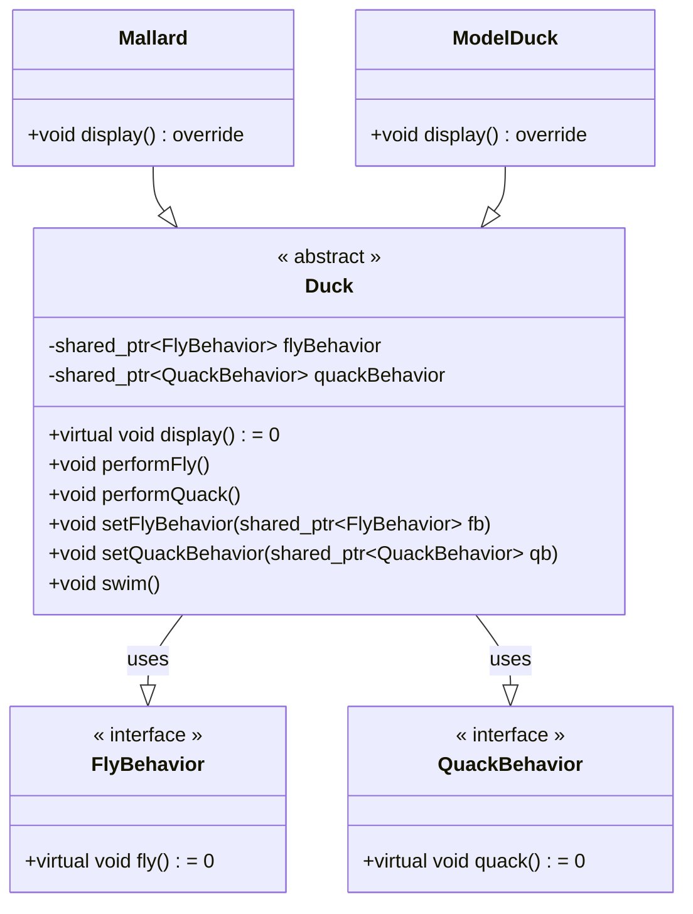

在这里，我们将 `Duck` 类中的 `flyBehavior` 和 `quackBehavior` 都封装为了一个类，其行为由相应的类负责。这样鸭子的行为就和鸭子类无关了。

注意，我们的 `Duck` 类是一个抽象类，它必须实例化之后才可以使用。使用 C++ 时，为了实现从父类调用子类方法，我们需要使用指针（在这里使用了智能指针），并使用 `virtual` 关键字。

此外，由于 C++ 中没有 `interface` 关键字，我们实际还是使用抽象类来实现“接口”，后续的章节也是一样的操作。


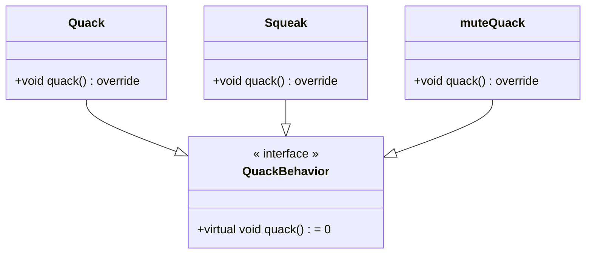

在子类中重写父亲方法，使用 `override` 关键字可以让编辑器辅助检查是否重写了虚函数，避免因函数参数不同等问题，造成重写失败。


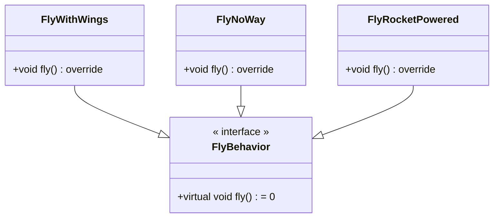

那么这样就实现了鸭子类的功能。我们封装了变化。使用组合而不是继承，增加了代码的复用性，同时便于拓展。

??? caution "代码拿来"

	```cpp
	// Strategy Pattern

	#include <iostream>
	#include <memory>
	using namespace std;

	class FlyBehavior {
	public:
	virtual void fly() = 0;
	};

	class QuackBehavior {
	public:
	virtual void quack() = 0;
	};

	// abstract class
	class Duck {
	protected:
	shared_ptr<FlyBehavior> flyBehavior;
	shared_ptr<QuackBehavior> quackBehavior;

	public:
	Duck() {}
	virtual void display() = 0;
	void performFly() { flyBehavior->fly(); }
	void performQuack() { quackBehavior->quack(); }
	void setFlyBehavior(shared_ptr<FlyBehavior> fb) { flyBehavior = fb; }
	void setQuackBehavior(shared_ptr<QuackBehavior> qb) { quackBehavior = qb; }
	void swim() { cout << "All ducks float, even decoys!" << endl; }
	};

	class FlyWithWings : public FlyBehavior {
	public:
	void fly() override { cout << "I'm flying!!" << endl; }
	};
	class FlyNoWay : public FlyBehavior {
	public:
	void fly() override { cout << "I can't fly" << endl; }
	};
	class FlyRocketPowered : public FlyBehavior {
	public:
	void fly() override { cout << "I'm flying with a rocket" << endl; }
	};

	class Quack : public QuackBehavior {
	public:
	void quack() override { cout << "Quack" << endl; }
	};
	class Squeak : public QuackBehavior {
	public:
	void quack() override { cout << "Squeak" << endl; }
	};
	class muteQuack : public QuackBehavior {
	public:
	void quack() override { cout << "<< Silence >>" << endl; }
	};

	class Mallard : public Duck {
	public:
	Mallard() {
		quackBehavior = make_shared<Quack>();
		flyBehavior = make_shared<FlyWithWings>();
	}
	void display() override { cout << "I'm a real Mallard duck" << endl; }
	};

	class ModelDuck : public Duck {
	public:
	ModelDuck() {
		flyBehavior = make_shared<FlyNoWay>();
		quackBehavior = make_shared<Quack>();
	}
	void display() override { cout << "I'm a model duck" << endl; }
	};

	int main() {
	unique_ptr<Duck> mallard(make_unique<Mallard>());
	mallard->performQuack();
	mallard->performFly();
	unique_ptr<Duck> model(make_unique<ModelDuck>());
	model->performFly();
	model->setFlyBehavior(make_shared<FlyRocketPowered>());
	model->performFly();
	}

	```

### 总结

设计原则

- 封装变化
- 多用组合，少用继承
- 针对接口编程，不针对实现编程

## 观察者模式

!!! abstract "观察者模式"
	定义了对象之间的一对多依赖，这样一来，当一个对象改变状态时，它的所有依赖者都会收到通知并自动更新

### 气象站与气象展示板

本节需要实现气象站与气象展示板的关系。气象站会定时更新气象数据，而气象展示板会显示最新的气象数据。

一种不合适的做法是在气象站类中直接调用气象展示板的方法，这样会导致气象站和气象展示板之间的耦合度过高。一旦气象展示板需要增加或减少，气象站类也需要修改。（不应当针对具体实现编程）

我们可以使用观察者模式来解决这个问题。观察者模式定义了对象之间的一对多依赖，这样一来，当一个对象改变状态时，它的所有依赖者都会收到通知并自动更新。
并且，观察者可以自由地订阅或取消订阅。

首先是 `Subject` 和 `Observer` 的接口。这里我们采用的是主题“推”数据的方式，即主题将数据推送给观察者。
关于“推”和“拉”的区别在于，如果使用“拉”数据的方式，观察者需要主动去获取数据，可以有选择地使用 `getter` 方法获取数据；而使用“推”数据的方式，主题会主动将数据推送给观察者，推送的数据是主题的全部数据，而不是观察者需要的特定部分数据。一般来说，“推”的方式更为“正确”

需要注意的是，由于观察者定义需要有主题的定义，主题定义也需要观察者的定义，在定义两个类时，需要使用前向声明，否则会出现编译错误。

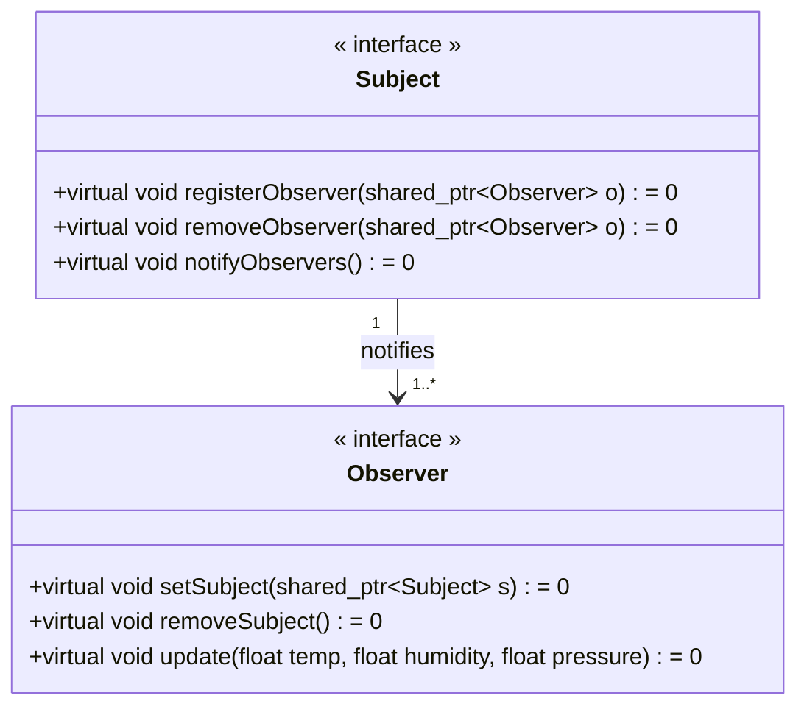

`WeatherData` 类实现了主题类，它维护了一个观察者列表，并且实现了注册、删除和通知观察者的方法。同时，`WeatherData` 类还维护了气象数据的状态，并且在数据发生变化时通知观察者。

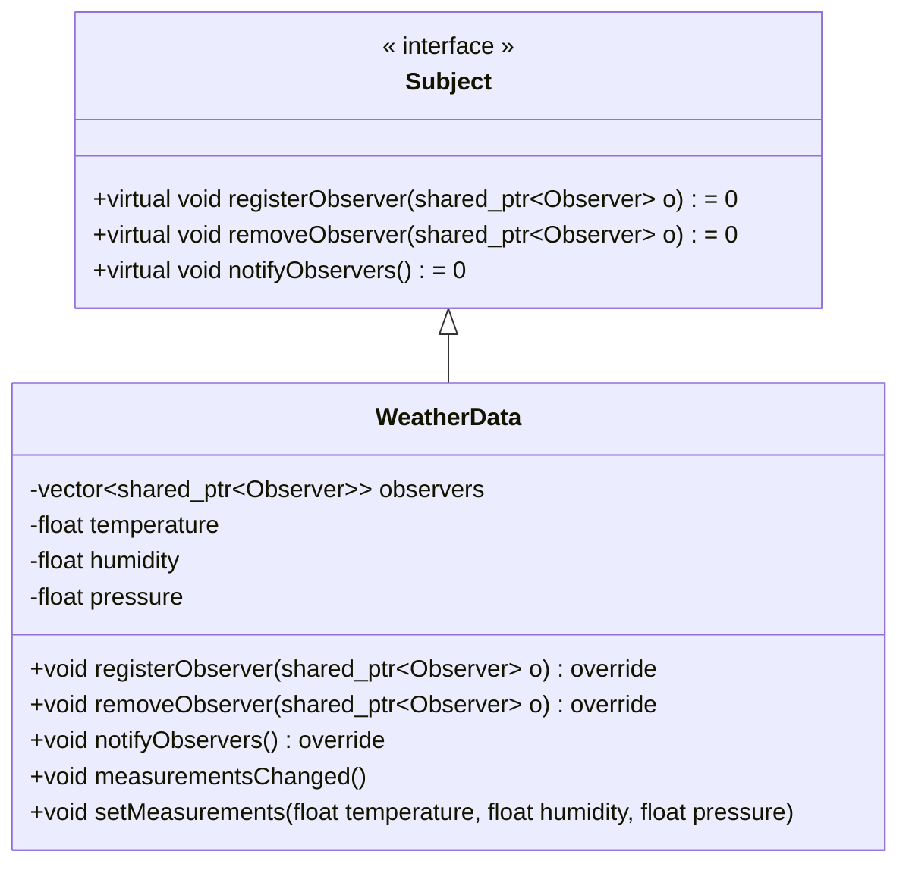

`DisplayElement` 抽象类和各个展示板的实现类。在观察者模式中，由于主题和观察者相互持有对方的引用，因此需要使用 `weak_ptr` 来避免循环引用。

同时，因为观察者类在设置主题时，需要调用主题的注册方法，这也就意味需要把一个 `this` 指针创建为 `shared_ptr` 传递给主题。
如果有多个主题，使用 `this` 裸指针会导致多次创建 `shared_ptr`。
从裸指针创建 `shared_ptr` 只可创建一次，否则多次创建 `shared_ptr`，会导致多次创建控制块，引发错误。

因此我们需要继承 `enable_shared_from_this<T>` 来保证 `this` 指针只创建一次控制块。
关于这个 `enable_shared_from_this<T>` 的用法，有一个专门的名字叫奇异递归模板模式，可以自行搜索。需要注意的是，调用 `shared_from_this()` 时，必须保证 已经调用过 `shared_ptr<T>` 的构造函数，否则会报错（即，类实例是一个由 `shared_ptr` 管理的对象）。

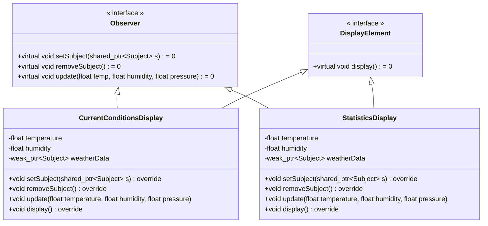

??? caution "代码拿来"

	```cpp
	// observer pattern

	#include <algorithm>
	#include <iostream>
	#include <memory>
	#include <vector>

	using namespace std;

	class Subject;
	class Observer {
	public:
	virtual void setSubject(shared_ptr<Subject> s) = 0;
	virtual void removeSubject() = 0;
	virtual void update(float temp, float humidity, float pressure) = 0;
	};

	class Subject {
	public:
	virtual void registerObserver(shared_ptr<Observer> o) = 0;
	virtual void removeObserver(shared_ptr<Observer> o) = 0;
	virtual void notifyObservers() = 0;
	};

	class DisplayElement {
	public:
	virtual void display() = 0;
	};

	class WeatherData : public Subject {
	private:
	vector<shared_ptr<Observer>> observers;
	float temperature;
	float humidity;
	float pressure;

	public:
	void registerObserver(shared_ptr<Observer> o) override {
		observers.push_back(o);
	}
	void removeObserver(shared_ptr<Observer> o) override {
		auto it = find(observers.begin(), observers.end(), o);
		if (it != observers.end()) {
		observers.erase(it);
		}
	}
	void notifyObservers() override {
		for (auto o : observers) {
		o->update(temperature, humidity, pressure);
		}
	}
	void measurementsChanged() { notifyObservers(); }
	void setMeasurements(float temperature, float humidity, float pressure) {
		this->temperature = temperature;
		this->humidity = humidity;
		this->pressure = pressure;
		measurementsChanged();
	}
	};

	class CurrentConditionsDisplay
		: public Observer,
		DisplayElement,
		public enable_shared_from_this<CurrentConditionsDisplay> {
	private:
	float temperature;
	float humidity;
	weak_ptr<Subject> weatherData; // actually, one observer can observe many
									// subjects, but we don't implement it here

	public:
	CurrentConditionsDisplay() = default;
	~CurrentConditionsDisplay() { removeSubject(); }

	void setSubject(shared_ptr<Subject> s) override {
		if (weatherData.lock() != nullptr) {
		return;
		}
		weatherData = s;
		s->registerObserver(shared_from_this());
	}

	void removeSubject() override {
		auto sptrWeatherData = weatherData.lock();
		if (sptrWeatherData == nullptr) {
		return;
		}
		sptrWeatherData->removeObserver(shared_from_this());
		weatherData.reset();
	}

	void update(float temperature, float humidity, float pressure) {
		this->temperature = temperature;
		this->humidity = humidity;
		display();
	}
	void display() override {
		std::cout << "Current conditions: " << temperature << "F degrees and "
				<< humidity << "% humidity" << std::endl;
	}
	};

	class StatisticsDisplay : public Observer,
							DisplayElement,
							public enable_shared_from_this<StatisticsDisplay> {
	private:
	float temperature;
	float humidity;
	weak_ptr<Subject> weatherData;

	public:
	void setSubject(shared_ptr<Subject> s) override {
		if (weatherData.lock() != nullptr) {
		return;
		}
		weatherData = s;
		s->registerObserver(shared_from_this());
	}

	void removeSubject() override {
		auto sptrWeatherData = weatherData.lock();
		if (sptrWeatherData == nullptr) {
		return;
		}
		sptrWeatherData->removeObserver(shared_from_this());
		weatherData.reset();
	}

	void update(float temperature, float humidity, float pressure) {
		this->temperature = temperature;
		this->humidity = humidity;
		display();
	}

	void display() override {
		std::cout << "Statistics: " << temperature << "F degrees and " << humidity
				<< "% humidity" << std::endl;
	}
	};

	class ForecastDisplay : public Observer,
							DisplayElement,
							public enable_shared_from_this<ForecastDisplay> {
	private:
	float temperature;
	float humidity;
	weak_ptr<Subject> weatherData;

	public:
	void setSubject(shared_ptr<Subject> s) override {
		if (weatherData.lock() != nullptr) {
		return;
		}
		weatherData = s;
		s->registerObserver(shared_from_this());
	}

	void removeSubject() override {
		auto sptrWeatherData = weatherData.lock();
		if (sptrWeatherData == nullptr) {
		return;
		}
		sptrWeatherData->removeObserver(shared_from_this());
		weatherData.reset();
	}

	void update(float temperature, float humidity, float pressure) {
		this->temperature = temperature;
		this->humidity = humidity;
		display();
	}

	void display() override {
		std::cout << "Forecast: " << temperature << "F degrees and " << humidity
				<< "% humidity" << std::endl;
	}
	};

	class HeatIndexDisplay : public Observer,
							DisplayElement,
							public enable_shared_from_this<HeatIndexDisplay> {
	private:
	float temperature;
	float humidity;
	weak_ptr<Subject> weatherData;

	public:
	void setSubject(shared_ptr<Subject> s) override {
		if (weatherData.lock() != nullptr) {
		return;
		}
		weatherData = s;
		s->registerObserver(shared_from_this());
	}

	void removeSubject() override {
		auto sptrWeatherData = weatherData.lock();
		if (sptrWeatherData == nullptr) {
		return;
		}
		sptrWeatherData->removeObserver(shared_from_this());
		weatherData.reset();
	}

	void update(float temperature, float humidity, float pressure) {
		this->temperature = temperature;
		this->humidity = humidity;
		display();
	}

	void display() override {
		std::cout << "Heat index is " << computeHeatIndex(temperature, humidity)
				<< std::endl;
	}

	private:
	double computeHeatIndex(double t, double rh) {
		double index =
			(16.923 + 1.85212 * t + 5.37941 * rh - 0.100254 * t * rh +
			0.00941695 * (t * t) + 0.00728898 * (rh * rh) +
			0.000345372 * (t * t * rh) - 0.000814971 * (t * rh * rh) +
			0.0000102102 * (t * t * rh * rh) - 0.000038646 * (t * t * t) +
			0.0000291583 * (rh * rh * rh) + 0.00000142721 * (t * t * t * rh) +
			0.000000197483 * (t * rh * rh * rh) -
			0.0000000218429 * (t * t * t * rh * rh) +
			0.000000000843296 * (t * t * rh * rh * rh) -
			0.0000000000481975 * (t * t * t * rh * rh * rh));
		return index;
	}
	};

	int main() {
	{
		auto weatherData(make_shared<WeatherData>());
		auto currentDisplay(make_shared<CurrentConditionsDisplay>());
		auto statisticsDisplay(make_shared<StatisticsDisplay>());
		auto forecastDisplay(make_shared<ForecastDisplay>());
		auto heatIndexDisplay(make_shared<HeatIndexDisplay>());

		weatherData->setMeasurements(80, 65, 30.4);
		currentDisplay->setSubject(weatherData);
		statisticsDisplay->setSubject(weatherData);
		forecastDisplay->setSubject(weatherData);
		heatIndexDisplay->setSubject(weatherData);
		weatherData->setMeasurements(82, 70, 29.2);
		currentDisplay->removeSubject();
		weatherData->setMeasurements(78, 90, 29.2);
	}
	return 0;
	}
	```


### 总结

要点

- 主题需要管理订阅的观察者，以及一个通知观察者的函数
- 观察者需要向主题提供一个更新函数
- 观察者包含主题的一个引用可以更方便地取消订阅
- 可以通过 `setChanged` 方法控制主题的通知频率，避免主题对数据变化太过敏感
- 不应该依赖于通知的顺序

设计原则

- 封装变化
- 多用组合，少用继承
- 针对接口编程，不针对实现编程
- 为了交互对象之间的松耦合设计而努力

## 装饰者模式

!!! abstract "装饰者模式"
	动态地将责任附加到对象上。若要扩展功能，装饰者提供了比继承更有弹性的替代方案

### 咖啡店订单系统

饮料类有一个抽象基类，各种饮料都继承自这个基类。

- 我们就需要在每个饮料类中添加这些调料，这样会导致代码的复杂性增加。
- 如何计算价格也是一个问题

使用实例变量记录添加的配料，从而简化价格计算，这种方法也不是很好。

- 配料的价格会变动
- 以后可能会有新的配料加入
- 有些饮料不适合加入某些配料

使用装饰者模式可以解决这个问题。以饮料为主体，运行时以调料来“装饰”饮料

- 装饰者和被装饰对象有相同的超类型
- 可以用一或者多个装饰者包装一个对象
- 在任何需要原始对象的场合，可以用装饰过的对象代替它
- 装饰者可以在所委托被装饰者的行为之前与/或之后，加上自己的行为，以达到特定的目的
- 对象可以在任何时候被装饰，所以可以在运行时动态地，不限量地用合适的装饰者来装饰对象

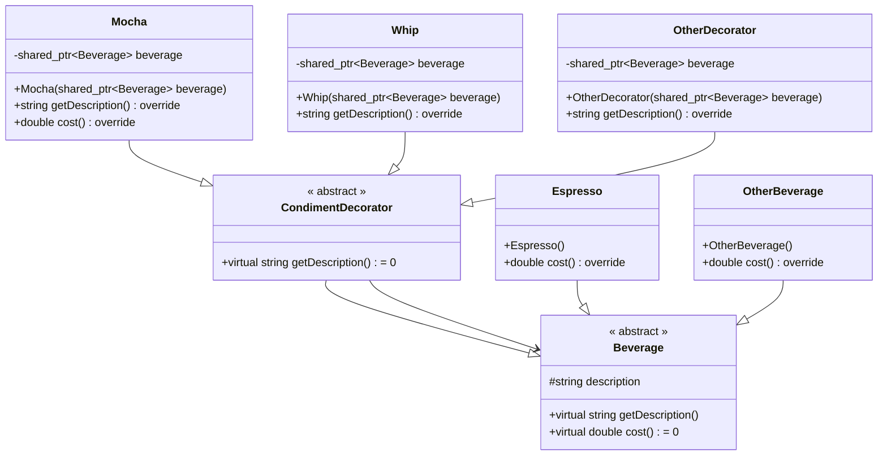


??? caution "代码拿来"

	```c++
	// decorator pattern

	#include <iostream>
	#include <memory>
	#include <string>

	using namespace std;

	// component
	class Beverage {
	public:
	virtual string getDescription() { return description; }
	virtual double cost() = 0;

	protected:
	string description = "Unknown Beverage";
	};

	class Espresso : public Beverage {
	public:
	Espresso() { description = "Espresso"; }
	double cost() override { return 1.99; }
	};

	class HouseBlend : public Beverage {
	public:
	HouseBlend() { description = "House Blend Coffee"; }
	double cost() override { return .89; }
	};

	class DarkRoast : public Beverage {
	public:
	DarkRoast() { description = "Dark Roast Coffee"; }
	double cost() override { return .99; }
	};

	class Decaf : public Beverage {
	public:
	Decaf() { description = "Decaf Coffee"; }
	double cost() override { return 1.05; }
	};

	// decorator
	class CondimentDecorator : public Beverage {
	public:
	virtual string getDescription() = 0;
	};

	class Mocha : public CondimentDecorator {
	public:
	Mocha(shared_ptr<Beverage> beverage) { this->beverage = beverage; }
	string getDescription() override {
		return beverage->getDescription() + ", Mocha";
	}
	double cost() override { return .20 + beverage->cost(); }

	private:
	shared_ptr<Beverage> beverage;
	};

	class Whip : public CondimentDecorator {
	public:
	Whip(shared_ptr<Beverage> beverage) { this->beverage = beverage; }
	string getDescription() override {
		return beverage->getDescription() + ", Whip";
	}
	double cost() override { return .10 + beverage->cost(); }

	private:
	shared_ptr<Beverage> beverage;
	};

	class Soy : public CondimentDecorator {
	public:
	Soy(shared_ptr<Beverage> beverage) { this->beverage = beverage; }
	string getDescription() override {
		return beverage->getDescription() + ", Soy";
	}
	double cost() override { return .15 + beverage->cost(); }

	private:
	shared_ptr<Beverage> beverage;
	};

	int main() {
	shared_ptr<Beverage> beverage = make_shared<Espresso>();
	cout << beverage->getDescription() << " $" << beverage->cost() << endl;

	shared_ptr<Beverage> beverage2 = make_shared<DarkRoast>();
	beverage2 = make_shared<Mocha>(beverage2);
	beverage2 = make_shared<Whip>(beverage2);
	cout << beverage2->getDescription() << " $" << beverage2->cost() << endl;

	shared_ptr<Beverage> beverage3 = make_shared<HouseBlend>();
	beverage3 = make_shared<Soy>(beverage3);
	beverage3 = make_shared<Mocha>(beverage3);
	beverage3 = make_shared<Whip>(beverage3);
	cout << beverage3->getDescription() << " $" << beverage3->cost() << endl;

	return 0;
	}
	```

### 总结

要点

- 装饰者模式意味着一群装饰者类
- 装饰者类反映出被装饰的组件类型
- 装饰者可以在被装饰者的行为之前与/或之后加上自己的行为，甚至取代被装饰者的行为，以达到特定的目的
- 装饰者一般对组件的客户是透明的，除非客户程序依赖于组件的具体类型
- 装饰者会导致设计中出现许多小对象，如果过度使用，会让程序变得很复杂


设计原则

- 封装变化
- 多用组合，少用继承
- 针对接口编程，不针对实现编程
- 为了交互对象之间的松耦合设计而努力
- 类应该对扩展开放，对修改关闭

## 工厂模式

!!! abstract "简单工厂（荣誉提名）"
	简单工厂并不是一个设计模式，而是一种编程习惯。简单工厂是一个类，它根据参数的不同返回不同类的实例，被称为工厂类。

### 披萨店订餐系统

- new 的问题

	- 当使用“new”时，就是在实例化一个具体类，这样就会导致代码依赖具体类，一旦有变化或拓展，就必须重新打开这段代码进行检查和修改。
	- 应当将实例化具体类的代码从应用中抽离或封装起来，使不会干挂应用的其他部分。

- 披萨的准备、烘烤等都可以调用接口。
- 问题在于披萨的种类太多，改动披萨种类就得修改订餐函数。
	
	- 将披萨的定义交给工厂——简单工厂

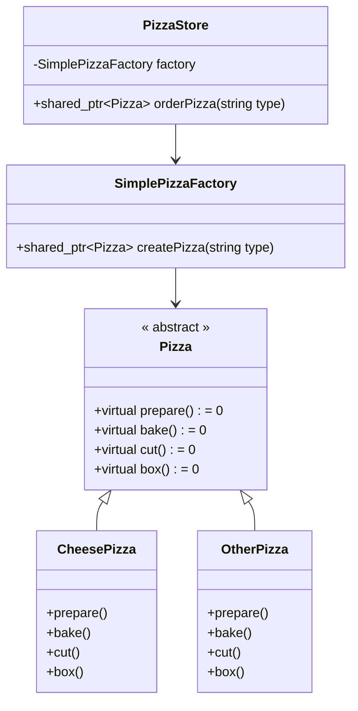

??? caution "代码拿来"

	```c++
	// simple facotry

	#include <iostream>
	#include <memory>

	class Pizza {
	public:
	virtual void prepare() = 0;
	virtual void bake() = 0;
	virtual void cut() = 0;
	virtual void box() = 0;
	};

	class CheesePizza : public Pizza {
	public:
	void prepare() override {
		std::cout << "Preparing Cheese Pizza" << std::endl;
	}
	void bake() override { std::cout << "Baking Cheese Pizza" << std::endl; }
	void cut() override { std::cout << "Cutting Cheese Pizza" << std::endl; }
	void box() override { std::cout << "Boxing Cheese Pizza" << std::endl; }
	};

	class PepperoniPizza : public Pizza {
	public:
	void prepare() override {
		std::cout << "Preparing Pepperoni Pizza" << std::endl;
	}
	void bake() override { std::cout << "Baking Pepperoni Pizza" << std::endl; }
	void cut() override { std::cout << "Cutting Pepperoni Pizza" << std::endl; }
	void box() override { std::cout << "Boxing Pepperoni Pizza" << std::endl; }
	};

	class ClamPizza : public Pizza {
	public:
	void prepare() override { std::cout << "Preparing Clam Pizza" << std::endl; }
	void bake() override { std::cout << "Baking Clam Pizza" << std::endl; }
	void cut() override { std::cout << "Cutting Clam Pizza" << std::endl; }
	void box() override { std::cout << "Boxing Clam Pizza" << std::endl; }
	};

	class VeggiePizza : public Pizza {
	public:
	void prepare() override {
		std::cout << "Preparing Veggie Pizza" << std::endl;
	}
	void bake() override { std::cout << "Baking Veggie Pizza" << std::endl; }
	void cut() override { std::cout << "Cutting Veggie Pizza" << std::endl; }
	void box() override { std::cout << "Boxing Veggie Pizza" << std::endl; }
	};

	enum class PizzaType { CHEESE, PEPPERONI, CLAM, VEGGIE };

	class SimplePizzaFactory {
	public:
	std::shared_ptr<Pizza> createPizza(PizzaType type) {
		std::shared_ptr<Pizza> pizza = nullptr;
		switch (type) {
		case PizzaType::CHEESE:
			pizza = std::make_shared<CheesePizza>();
			break;
		case PizzaType::PEPPERONI:
			pizza = std::make_shared<PepperoniPizza>();
			break;
		case PizzaType::CLAM:
			pizza = std::make_shared<ClamPizza>();
			break;
		case PizzaType::VEGGIE:
			pizza = std::make_shared<VeggiePizza>();
			break;
		default:
			break;
		}

		return pizza;
	}
	};

	class PizzaStore {
	public:
	PizzaStore(SimplePizzaFactory factory) : factory(factory) {}

	std::shared_ptr<Pizza> orderPizza(PizzaType type) {
		std::shared_ptr<Pizza> pizza = factory.createPizza(type);
		pizza->prepare();
		pizza->bake();
		pizza->cut();
		pizza->box();
		return pizza;
	}

	private:
	SimplePizzaFactory factory;
	};

	int main() {
	SimplePizzaFactory factory;
	PizzaStore store(factory);
	std::shared_ptr<Pizza> pizza = store.orderPizza(PizzaType::CHEESE);
	}
		
	```

!!! abstract "工厂方法"
	定义了一个创建对象的接口，但由子类决定要实例化的类是哪一个。工厂方法让类把实例化推迟到子类。

### 加盟店

各加盟店需要遵循基本的制作流程，但又想要提供不同风味的披萨。如果按之前“简单工厂”的方式，为每个加盟店写一个工厂类。但这样，加盟店就无法进行自己的改良。我们需要一个框架，把加盟店和创建披萨捆绑在一起，同时又保持一定的弹性。

将创建披萨的方法放在 `PizzaStore` 中，允许子类对 `createPizza` 进行重写，从而实现加盟店自行决定披萨的特点


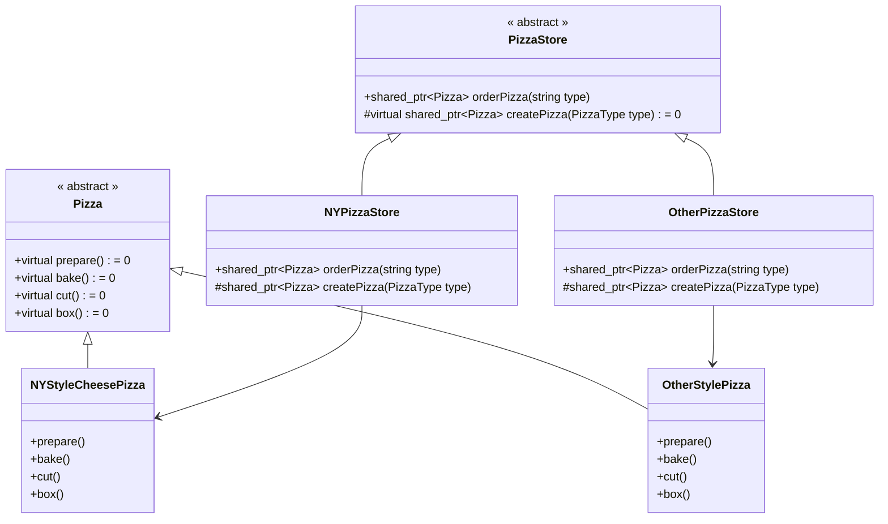

??? caution "代码拿来"

	```c++
    // factory method pattern
    #include <iostream>
    #include <memory>
    #include <string>
    #include <vector>

    using namespace std;

    class Pizza {
    protected:
    string name;
    string dough;
    string sauce;
    vector<string> toppings;

    public:
    virtual void prepare() {
        std::cout << "Preparing " << name << std::endl;
        std::cout << "Tossing dough..." << std::endl;
        std::cout << "Adding sauce..." << std::endl;
        std::cout << "Adding toppings: " << std::endl;
        for (auto topping : toppings) {
        std::cout << "   " << topping << std::endl;
        }
    }

    virtual void bake() {
        std::cout << "Bake for 25 minutes at 350" << std::endl;
    }

    virtual void cut() {
        std::cout << "Cutting the pizza into diagonal slices" << std::endl;
    }

    virtual void box() {
        std::cout << "Place pizza in official PizzaStore box" << std::endl;
    }

    string getName() { return name; }
    };

    class NYStyleCheesePizza : public Pizza {
    public:
    NYStyleCheesePizza() {
        name = "NY Style Sauce and Cheese Pizza";
        dough = "Thin Crust Dough";
        sauce = "Marinara Sauce";
        toppings.push_back("Grated Reggiano Cheese");
    }
    };

    class NYStylePepperoniPizza : public Pizza {
    public:
    NYStylePepperoniPizza() { name = "NY Style Pepperoni Pizza"; }
    };

    class NYStyleClamPizza : public Pizza {
    public:
    NYStyleClamPizza() { name = "NY Style Clam Pizza"; }
    };

    class NYStyleVeggiePizza : public Pizza {
    public:
    NYStyleVeggiePizza() { name = "NY Style Veggie Pizza"; }
    };

    class ChicagoStyleCheesePizza : public Pizza {
    public:
    ChicagoStyleCheesePizza() {
        name = "Chicago Style Deep Dish Cheese Pizza";
        dough = "Extra Thick Crust Dough";
        sauce = "Plum Tomato Sauce";
        toppings.push_back("Shredded Mozzarella Cheese");
    }

    void cut() {
        std::cout << "Cutting the pizza into square slices" << std::endl;
    }
    };

    class ChicagoStylePepperoniPizza : public Pizza {
    public:
    ChicagoStylePepperoniPizza() { name = "Chicago Style Pepperoni Pizza"; }
    };

    class ChicagoStyleClamPizza : public Pizza {
    public:
    ChicagoStyleClamPizza() { name = "Chicago Style Clam Pizza"; }
    };

    class ChicagoStyleVeggiePizza : public Pizza {
    public:
    ChicagoStyleVeggiePizza() { name = "Chicago Deep Dish Veggie Pizza"; }
    };

    enum class PizzaType { CHEESE, PEPPERONI, CLAM, VEGGIE };

    class PizzaStore {
    public:
    std::shared_ptr<Pizza> orderPizza(PizzaType type) {
        std::shared_ptr<Pizza> pizza = createPizza(type);
        pizza->prepare();
        pizza->bake();
        pizza->cut();
        pizza->box();
        return pizza;
    }

    protected:
    virtual std::shared_ptr<Pizza> createPizza(PizzaType type) = 0;
    };

    class NYPizzaStore : public PizzaStore {
    protected:
    std::shared_ptr<Pizza> createPizza(PizzaType type) override {
        std::shared_ptr<Pizza> pizza = nullptr;
        if (type == PizzaType::CHEESE) {
        pizza = std::make_shared<NYStyleCheesePizza>();
        } else if (type == PizzaType::PEPPERONI) {
        pizza = std::make_shared<NYStylePepperoniPizza>();
        } else if (type == PizzaType::CLAM) {
        pizza = std::make_shared<NYStyleClamPizza>();
        } else if (type == PizzaType::VEGGIE) {
        pizza = std::make_shared<NYStyleVeggiePizza>();
        }
        return pizza;
    }
    };

    class ChicagoPizzaStore : public PizzaStore {
    protected:
    std::shared_ptr<Pizza> createPizza(PizzaType type) override {
        std::shared_ptr<Pizza> pizza = nullptr;
        if (type == PizzaType::CHEESE) {
        pizza = std::make_shared<ChicagoStyleCheesePizza>();
        } else if (type == PizzaType::PEPPERONI) {
        pizza = std::make_shared<ChicagoStylePepperoniPizza>();
        } else if (type == PizzaType::CLAM) {
        pizza = std::make_shared<ChicagoStyleClamPizza>();
        } else if (type == PizzaType::VEGGIE) {
        pizza = std::make_shared<ChicagoStyleVeggiePizza>();
        }
        return pizza;
    }
    };


    int main() {
    std::unique_ptr<PizzaStore> nyStore = std::make_unique<NYPizzaStore>();
    std::unique_ptr<PizzaStore> chicagoStore =
        std::make_unique<ChicagoPizzaStore>();

    std::shared_ptr<Pizza> pizza = nyStore->orderPizza(PizzaType::CHEESE);
    std::cout << "Ethan ordered a " << pizza->getName() << std::endl;

    pizza = chicagoStore->orderPizza(PizzaType::CHEESE);
    std::cout << "Joel ordered a " << pizza->getName() << std::endl;

    return 0;
    }
		
	```


!!! abstract "抽象工厂"
	提供一个接口，用于创建相关或依赖对象的家庭。

### 原料工厂

各个加盟店使用的原料参差不齐，我们需要使用统一供应的原料。
不同的加盟店可能使用不同的原料。我们要建造一个原料工厂，用于生产原料。

让工厂负责创建原料家庭中的每一种原料：面团、酱料、芝士等等。
不同的披萨店只需要从原料工厂获取特定风味的原料就行。


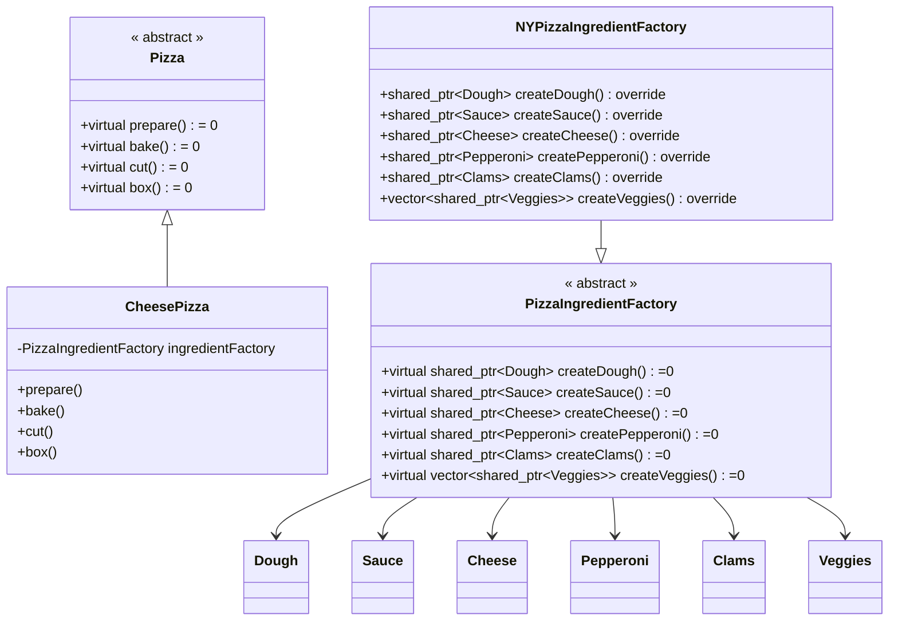


??? caution "代码拿来"

	```c++
	// abstract factory pattern
	#include <iostream>
	#include <memory>
	#include <string>
	#include <vector>
	using namespace std;

	class Dough {};
	class Sauce {};
	class Cheese {};
	class Pepperoni {};
	class Clams {};
	class Veggies {};

	class Garlic : public Veggies {};
	class Onion : public Veggies {};
	class Mushroom : public Veggies {};
	class RedPepper : public Veggies {};
	class BlackOlives : public Veggies {};
	class Spinach : public Veggies {};
	class EggPlant : public Veggies {};

	class PizzaIngredientFactory {
	public:
	virtual shared_ptr<Dough> createDough() = 0;
	virtual shared_ptr<Sauce> createSauce() = 0;
	virtual shared_ptr<Cheese> createCheese() = 0;
	virtual shared_ptr<Pepperoni> createPepperoni() = 0;
	virtual shared_ptr<Clams> createClams() = 0;
	virtual vector<shared_ptr<Veggies>> createVeggies() = 0;
	};

	//

	class ThinCrustDough : public Dough {};
	class MarinaraSauce : public Sauce {};
	class ReggianoCheese : public Cheese {};
	class SlicedPepperoni : public Pepperoni {};
	class FreshClams : public Clams {};

	class NYPizzaIngredientFactory : public PizzaIngredientFactory {
	public:
	shared_ptr<Dough> createDough() override {
		return make_shared<ThinCrustDough>();
	}
	shared_ptr<Sauce> createSauce() override {
		return make_shared<MarinaraSauce>();
	}
	shared_ptr<Cheese> createCheese() override {
		return make_shared<ReggianoCheese>();
	}
	shared_ptr<Pepperoni> createPepperoni() override {
		return make_shared<SlicedPepperoni>();
	}
	shared_ptr<Clams> createClams() override { return make_shared<FreshClams>(); }
	vector<shared_ptr<Veggies>> createVeggies() override {
		vector<shared_ptr<Veggies>> veggies;
		veggies.push_back(make_shared<Garlic>());
		veggies.push_back(make_shared<Onion>());
		veggies.push_back(make_shared<Mushroom>());
		veggies.push_back(make_shared<RedPepper>());
		return veggies;
	}
	};

	class ThickCrustDough : public Dough {};
	class PlumTomatoSauce : public Sauce {};
	class MozzarellaCheese : public Cheese {};
	class FrozenClams : public Clams {};

	class ChicagoPizzaIngredientFactory : public PizzaIngredientFactory {
	public:
	shared_ptr<Dough> createDough() override {
		return make_shared<ThickCrustDough>();
	}
	shared_ptr<Sauce> createSauce() override {
		return make_shared<PlumTomatoSauce>();
	}
	shared_ptr<Cheese> createCheese() override {
		return make_shared<MozzarellaCheese>();
	}
	shared_ptr<Pepperoni> createPepperoni() override {
		return make_shared<SlicedPepperoni>();
	}
	shared_ptr<Clams> createClams() override {
		return make_shared<FrozenClams>();
	}
	vector<shared_ptr<Veggies>> createVeggies() override {
		vector<shared_ptr<Veggies>> veggies;
		veggies.push_back(make_shared<BlackOlives>());
		veggies.push_back(make_shared<Spinach>());
		veggies.push_back(make_shared<EggPlant>());
		return veggies;
	}
	};

	class Pizza {
	public:
	virtual void prepare() = 0;
	virtual void bake() { cout << "Bake for 25 minutes at 350" << endl; }
	virtual void cut() {
		cout << "Cutting the pizza into diagonal slices" << endl;
	}
	virtual void box() {
		cout << "Place pizza in official PizzaStore box" << endl;
	}
	void setName(string name) { this->name = name; }
	string getName() { return name; }
	string toString() {
		// code to display pizza name and ingredients
		return "";
	}

	protected:
	string name;
	shared_ptr<Dough> dough;
	shared_ptr<Sauce> sauce;
	shared_ptr<Cheese> cheese;
	shared_ptr<Pepperoni> pepperoni;
	shared_ptr<Clams> clams;
	vector<shared_ptr<Veggies>> veggies;
	};

	class CheesePizza : public Pizza {
	public:
	CheesePizza(PizzaIngredientFactory* ingredientFactory) {
		this->ingredientFactory = ingredientFactory;
	}
	void prepare() override {
		cout << "Preparing " << name << endl;
		dough = ingredientFactory->createDough();
		sauce = ingredientFactory->createSauce();
		cheese = ingredientFactory->createCheese();
	}

	private:
	PizzaIngredientFactory* ingredientFactory;
	};

	class ClamPizza : public Pizza {
	public:
	ClamPizza(PizzaIngredientFactory* ingredientFactory) {
		this->ingredientFactory = ingredientFactory;
	}
	void prepare() override {
		cout << "Preparing " << name << endl;
		dough = ingredientFactory->createDough();
		sauce = ingredientFactory->createSauce();
		cheese = ingredientFactory->createCheese();
		clams = ingredientFactory->createClams();
	}

	private:
	PizzaIngredientFactory* ingredientFactory;
	};

	enum class PizzaType { CHEESE, CLAM };

	class NYPizzaStore : public PizzaStore {
	public:
	shared_ptr<Pizza> createPizza(PizzaType type) override {
		shared_ptr<Pizza> pizza = nullptr;
		PizzaIngredientFactory* ingredientFactory = new NYPizzaIngredientFactory();
		switch (type) {
		case PizzaType::CHEESE:
			pizza = make_shared<CheesePizza>(ingredientFactory);
			pizza->setName("New York Style Cheese Pizza");
			break;
		case PizzaType::CLAM:
			pizza = make_shared<ClamPizza>(ingredientFactory);
			pizza->setName("New York Style Clam Pizza");
			break;
		}
		return pizza;
	}
	};

	class ChicagoPizzaStore : public PizzaStore {
	public:
	shared_ptr<Pizza> createPizza(PizzaType type) override {
		shared_ptr<Pizza> pizza = nullptr;
		PizzaIngredientFactory* ingredientFactory =
			new ChicagoPizzaIngredientFactory();
		switch (type) {
		case PizzaType::CHEESE:
			pizza = make_shared<CheesePizza>(ingredientFactory);
			pizza->setName("Chicago Style Cheese Pizza");
			break;
		case PizzaType::CLAM:
			pizza = make_shared<ClamPizza>(ingredientFactory);
			pizza->setName("Chicago Style Clam Pizza");
			break;
		}
		return pizza;
	}
	};

	int main() {
	unique_ptr<PizzaStore> nyStore = make_unique<NYPizzaStore>();
	unique_ptr<PizzaStore> chicagoStore = make_unique<ChicagoPizzaStore>();

	shared_ptr<Pizza> pizza = nyStore->orderPizza(PizzaType::CHEESE);
	cout << "Ethan ordered a " << pizza->getName() << endl;

	pizza = chicagoStore->orderPizza(PizzaType::CLAM);
	cout << "Joel ordered a " << pizza->getName() << endl;
	}
		
	```

### 总结

要点

- 工厂方法让子类决定要实例化的类是哪一个
- 工厂方法使用继承
- 工厂方法允许类将实例化延迟到子类进行
- 参数化工厂方法中参数错误的问题可以通过，创建代表参数类型的对象和作用静态常量，或者枚举的方法解决
- 抽象工厂允许客户使用抽象的接口来创建一组相关的产品，而不需要知道（或关心）实际产出的具体产品是什么。这样一来，客户就从具体的产品中被解耦
- 抽象工厂使用对象组合
- 抽象工厂创建相关的对象家族，而不需要依赖它们的具体类

设计原则

- 多用组合，少用继承
- 针对接口编程，不针对实现编程
- 为了交互对象之间的松耦合设计而努力
- 类应该对扩展开放，对修改关闭
- 要依赖抽象，不要依赖具体类

	- 依赖倒置原则

		- 变量不可以持有具体类的引用
		- 不要让类派生自具体类
		- 不要覆盖基类中已实现的方法


## 单例模式


!!! abstract "单例模式"
	确保一个类只有一个实例，并提供一个全局访问点。

### 巧克力工厂

单例模式适用情景

- 线程池
- 缓存
- 对话框
- 偏好设置
- 注册表
- 日志
- 驱动

全局变量的缺点

- 需要的时候才创建对象，单例可以延迟实例化


经典的单例模式实现

- 利用一个静态变量记录单例类的唯一实例
- 声明类的构造器为私有的，只有单例类内部才可以调用
- 用静态的方法实例化对象，并返回这个实例

如何处理多线程？

- 只需要将那个获取单例静态方法 getInstance() 改为同步方法

	然而，我们只需要在实例化的那次才需要同步，后面再同步只是累赘

- getInstance() 性能不是关键，就不用管有什么额外负担

- 如果 getInstance() 调用很频繁，就得重新考虑了
	
	- 使用“急切”创建实例

		如果应用程序总是创建并使用单例实例，或者在创建和运行时方面的负担不太繁重，就可以在静态变量初始化时创建单例

	- 使用“双重检查加锁”，减少使用同步

		先检查单例是否存在，然后再进入同步代码
		需要使用 volatile 关键字

在 《Effective C++》的条款 4 中，提到了一个更好的方法，即静态局部变量，它的特点是

- 仅当程序第一次执行到 `GetInstance` 函数时，执行 `instance` 对象的初始化；
- 在 C++ 11 之后，被 `static` 修饰的变量可以保证是线程安全的；

同时，我们删除了拷贝构造函数和赋值操作符。

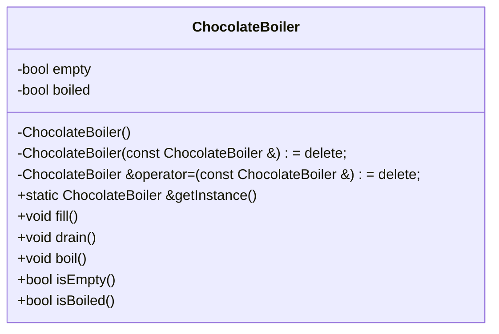


??? caution "代码拿来"

	```c++
	// Singleton
	#include <iostream>
	#include <condition_variable>
	#include <mutex>

	class ChocolateBoiler {
	private:
	bool empty;
	bool boiled;

	ChocolateBoiler() : empty(true), boiled(false) {
		std::cout << "Creating unique instance of Chocolate Boiler" << std::endl;
	}

	public:
	ChocolateBoiler(const ChocolateBoiler &) = delete;
	ChocolateBoiler &operator=(const ChocolateBoiler &) = delete;
	
	// best of all, from effective c++ item 4
	static ChocolateBoiler &getInstance() {
		static ChocolateBoiler uniqueInstance;
		return uniqueInstance;
	}

	void fill() {
		if (isEmpty()) {
		empty = false;
		boiled = false;
		// fill the boiler with a milk/chocolate mixture
		}
	}

	void drain() {
		if (!isEmpty() && isBoiled()) {
		// drain the boiled milk and chocolate
		empty = true;
		}
	}

	void boil() {
		if (!isEmpty() && !isBoiled()) {
		// bring the contents to a boil
		boiled = true;
		}
	}

	bool isEmpty() { return empty; }

	bool isBoiled() { return boiled; }
	};

	std::mutex mtx;
	std::condition_variable cv;
	bool ready = false;

	void runChocolateBoiler(int id) {
	ChocolateBoiler &boiler = ChocolateBoiler::getInstance();
	boiler.fill();
	boiler.boil();
	boiler.drain();
	}

	void threadStart() {
	std::unique_lock<std::mutex> lck(mtx);
	ready = true;
	cv.notify_all();
	}

	int main() {
	// test singleton in 10 threads
	std::thread threads[10];
	// spawn 10 threads:
	for (int i = 0; i < 10; ++i)
		threads[i] = std::thread(runChocolateBoiler, i);

	threadStart();

	for (auto &th : threads)
		th.join();

	return 0;
	}
	```

### 总结


要点

- 单例模式确保程序中一个类最多只有一个实例
- 单例模式也提供访问这个实例的全局点
- 确定在性能和资源上的限制，然后小心地选择适当的方案来实现单例，以解决多线程的问题
- 如果使用多个类加载器，可能导致单例失效产生多个实例


设计原则

- 封装变化
- 多用组合，少用继承
- 针对接口编程，不针对实现编程
- 为了交互对象之间的松耦合设计而努力
- 类应该对扩展开放，对修改关闭
- 依赖抽象，不要依赖具体类

